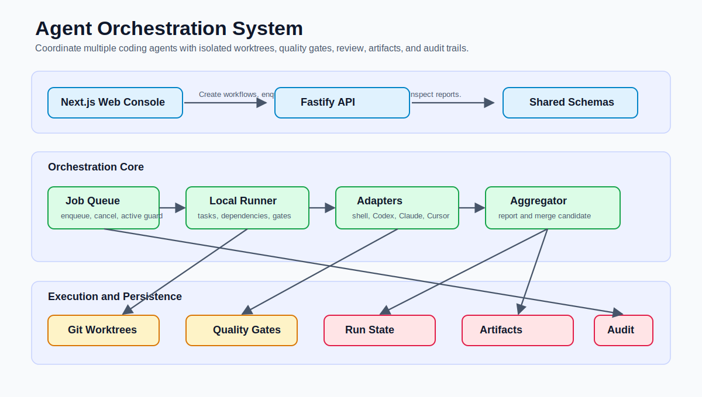
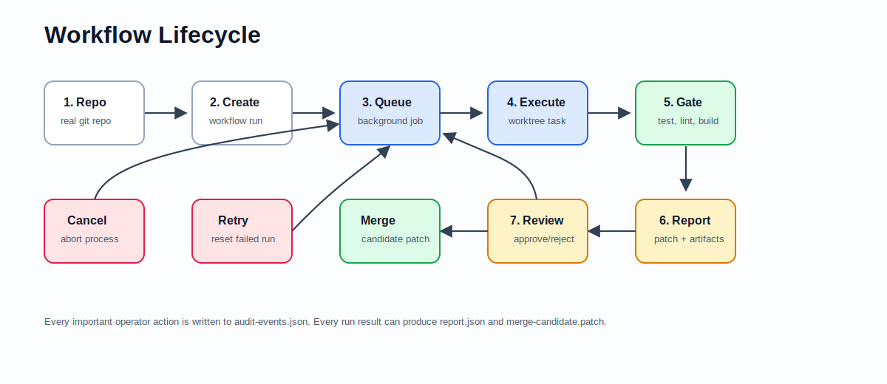
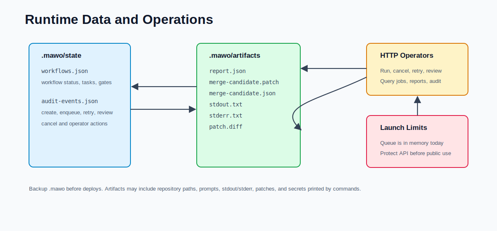

# Agent Orchestration System

一个面向真实代码仓库的多 Agent 工作流编排平台。它不是“多个聊天机器人窗口”，而是把 Codex、Claude Code、Cursor、Shell 脚本等执行器当成可调度、可隔离、可验收的工程工作单元，用任务图、质量门控、运行审计和结果聚合把复杂开发任务推到可审查、可合并的状态。

当前版本是 local-first 的可运行系统：前端控制台、Fastify API、真实 git worktree 隔离、任务队列、取消、重试、质量门控、报告、merge candidate、审计事件和文件持久化都已经接通。



## 这个项目解决什么问题

现在 AI coding agent 已经很多，比如 Claude Code、Codex、Cursor。单个 agent 能完成不少任务，但复杂项目里会遇到这些问题：

- 多个 agent 怎么分工，而不是互相覆盖同一份代码。
- 每个 agent 的执行过程、日志、diff、退出码怎么留痕。
- 怎么自动跑 lint、test、typecheck、build 等质量门。
- 怎么知道最终结果能不能合并，而不是只相信 agent 的自然语言总结。
- 怎么取消、重试、审查、拒绝、批准一次运行。
- 怎么把运行历史和关键操作记录下来，方便回放和排障。

本项目的目标是把“AI 写代码”升级成“AI 工程流水线”：任务被拆成节点，节点在独立 workspace 中执行，质量门自动验收，结果聚合成 report 和 patch，最后由人类做 review 决策。

## 产品心智模型



一次 workflow 大致分成 7 步：

1. 选择一个真实 git 仓库，输入目标、任务命令和质量门命令。
2. API 创建 workflow run，并写入 `.mawo/state/workflows.json`。
3. 用户把 workflow 放入后台队列，系统创建 job。
4. Runner 为任务创建独立 git worktree，让 agent 或 shell 在隔离环境中执行。
5. 任务完成后收集 stdout、stderr、git status、diff patch。
6. Quality gates 执行测试、lint、typecheck、build 或自定义命令。
7. Aggregator 生成 report 和 merge candidate，人类 approve/reject。

## 当前能力

- Next.js Run Console：创建 demo workflow、真实仓库 workflow、运行、取消、重试、审核。
- Fastify API：提供 workflow、job、report、merge candidate、audit events 等接口。
- 文件持久化：workflow 状态和审计事件保存在 `.mawo/state/`。
- Artifact Store：stdout、stderr、patch、report、merge candidate 保存在 `.mawo/artifacts/`。
- 后台队列：`POST /workflows/:id/enqueue` 非阻塞运行 workflow。
- 并发保护：同一个 workflow 同时只能有一个 queued/running job。
- 取消任务：queued job 不会启动，running job 会收到 abort signal 并终止底层进程。
- 真实仓库隔离：每个任务使用 git worktree 和独立分支。
- 质量门控：gate 失败会阻止 workflow 进入 review-ready。
- 重试：失败或取消的 workflow 可以 reset 后重新运行。
- 审计事件：记录 create、enqueue、retry、review、cancel 等操作。
- CLI Agent Adapter：支持通过环境变量接入 Codex、Claude、Cursor 等真实 CLI agent。

## 架构说明



核心模块：

| 模块 | 位置 | 作用 |
| --- | --- | --- |
| Web Console | `apps/web` | 操作界面，展示 workflow 图、任务日志、报告、merge candidate |
| API Server | `apps/api/src/server.ts` | HTTP 入口，负责校验请求、编排 runner/queue/store |
| LocalRunner | `apps/api/src/runner/local-runner.ts` | 执行 workflow、任务依赖、质量门、报告聚合 |
| WorkflowJobQueue | `apps/api/src/runner/workflow-job-queue.ts` | 后台队列、取消、active job guard |
| ShellAdapter | `apps/api/src/runner/shell-adapter.ts` | 执行 shell 命令、超时、取消、stdout/stderr 捕获 |
| CliAgentAdapter | `apps/api/src/runner/cli-agent-adapter.ts` | 把 CLI agent 包装成统一 runner |
| GitWorktreeManager | `apps/api/src/runner/git-worktree-manager.ts` | 创建 worktree、收集 diff、隔离任务执行 |
| FileRunStore | `apps/api/src/runner/file-run-store.ts` | 持久化 workflow 状态 |
| FileArtifactStore | `apps/api/src/runner/file-artifact-store.ts` | 持久化报告、日志、patch |
| FileAuditStore | `apps/api/src/runner/file-audit-store.ts` | 持久化操作审计事件 |
| Shared Schemas | `packages/shared` | 前后端共享 Zod schema 和 TypeScript 类型 |

## 快速开始

项目内置便携 Node.js 和 Git，Windows 上直接使用 `.tools` 即可。

```powershell
$root = (Get-Location).Path
$env:PATH = "$root\.tools\node;$root\.tools\git\cmd;$env:PATH"
```

安装和启动：

```powershell
.\.tools\node\npm.cmd install
.\.tools\node\npm.cmd run dev
```

默认地址：

- Web: `http://127.0.0.1:3000`
- API: `http://127.0.0.1:4000`
- Health: `http://127.0.0.1:4000/health`

常用验证命令：

```powershell
.\.tools\node\npm.cmd run test
.\.tools\node\npm.cmd run typecheck
.\.tools\node\npm.cmd run lint
.\.tools\node\npm.cmd run build
.\.tools\node\npm.cmd run smoke:api
```

## 真实仓库 Workflow 示例

创建一个真实仓库 workflow：

```powershell
$body = @{
  goal = "Run a real repository workflow"
  repositoryPath = "C:/path/to/repo"
  tasks = @(
    @{
      id = "repository-task"
      title = "Repository task"
      agent = "shell"
      command = "npm test"
      timeoutMs = 900000
    }
  )
  qualityGates = @(
    @{
      id = "quality-gate"
      title = "Quality gate"
      command = "npm run lint"
      timeoutMs = 300000
    }
  )
} | ConvertTo-Json -Depth 10

Invoke-RestMethod -Method Post `
  -Uri http://127.0.0.1:4000/workflows/repository `
  -ContentType "application/json" `
  -Body $body
```

运行、查看、重试：

```powershell
Invoke-RestMethod -Method Post http://127.0.0.1:4000/workflows/<id>/enqueue
Invoke-RestMethod http://127.0.0.1:4000/workflows/<id>
Invoke-RestMethod http://127.0.0.1:4000/workflows/<id>/report
Invoke-RestMethod http://127.0.0.1:4000/workflows/<id>/merge-candidate
Invoke-RestMethod -Method Post http://127.0.0.1:4000/workflows/<id>/retry
```

取消 queued/running job：

```powershell
Invoke-RestMethod -Method Post http://127.0.0.1:4000/jobs/<jobId>/cancel
```

审核 workflow：

```powershell
$review = @{ decision = "approve"; note = "Ready to apply" } | ConvertTo-Json
Invoke-RestMethod -Method Post `
  -Uri http://127.0.0.1:4000/workflows/<id>/review `
  -ContentType "application/json" `
  -Body $review
```

## API 一览

```text
GET  /health
GET  /agents
GET  /agents/health
GET  /workflows
GET  /repositories
POST /repositories
GET  /audit-events
GET  /audit-events?workflowId=<id>
POST /workflows/demo
POST /workflows/worktree-demo
POST /workflows/agent-demo
POST /workflows/repository
GET  /workflows/:id
POST /workflows/:id/enqueue
POST /workflows/:id/run
POST /workflows/:id/retry
POST /workflows/:id/review
GET  /workflows/:id/report
GET  /workflows/:id/merge-candidate
GET  /jobs
GET  /jobs/:id
POST /jobs/:id/cancel
```

## 运行数据放在哪里

运行时数据默认写在当前工作目录的 `.mawo` 下，不提交到 git。

```text
.mawo/
  state/
    workflows.json
    jobs.json
    repositories.json
    audit-events.json
  artifacts/
    <workflowId>/
      report.json
      merge-candidate.patch
      merge-candidate.json
      tasks/<taskId>/stdout.txt
      tasks/<taskId>/stderr.txt
      tasks/<taskId>/patch.diff
```

这些文件用于恢复 workflow 状态、查看 job 历史、复用已登记仓库、查看审计记录、排查运行失败和生成可应用的 patch。API 重启时，如果发现 `jobs.json` 里遗留的 queued/running job，会把它们标记为 failed，避免旧 job 永远占用运行槽。

## 接入真实 CLI Agent

默认总是有 fake demo agent。真实 CLI agent 通过环境变量注册：

```powershell
$env:MAWO_CODEX_COMMAND_TEMPLATE = "codex run --prompt-file {promptFile}"
$env:MAWO_CLAUDE_COMMAND_TEMPLATE = "claude -p @{promptFile}"
$env:MAWO_CURSOR_COMMAND_TEMPLATE = "cursor-agent {promptFile}"
```

支持的占位符：

- `{promptFile}`：系统生成的 agent prompt 文件。
- `{workspace}`：任务 worktree 路径。
- `{goal}`：workflow 目标。

prompt 文件写在 worktree 外部，避免内部编排文件污染任务 diff。

可以用健康检查接口确认已注册 agent 是否可执行：

```powershell
Invoke-RestMethod http://127.0.0.1:4000/agents/health
```

该接口会返回 agent id、label、状态、检查时间和解析出的命令名，不返回完整 command template，避免泄露 prompt/workspace 模板。

## 当前限制

- 目前是 local-first 系统，没有内置登录、权限、租户隔离。
- API 可以执行命令，不应直接暴露到公网。
- workflow、job history、仓库注册表和审计事件是文件持久化，暂不支持多 API 副本并发写。
- job queue 运行器仍在单 API 进程内；API 重启后历史会恢复，但重启前 queued/running job 会被标记为 failed，需要人工重试。
- Docker Compose 里有 Postgres/Redis，但当前主路径还没有切到数据库和 Redis queue。
- 真实 CLI agent 健康检查会确认命令是否存在，但不会执行登录态/授权探针；是否已登录仍需要运维侧确认。

## 路线图

近期优先级：

1. 工作区清理策略：保留、清理、归档、失败保留。
2. Agent 授权探针：在不启动真实任务的前提下检查 Codex/Claude/Cursor 是否已登录。
3. 更完整的审计和运行历史：每次 task/gate 开始、结束、失败都可追踪。
4. 部署模板：Dockerfile、Render/Vercel/Cloudflare/本机服务脚本。
5. 安全边界：本地访问控制、反向代理 auth、路径 allowlist。
6. 数据层升级：把文件状态迁移到 Postgres，把队列运行迁移到 Redis/worker。

## 文档入口

- [Operations Runbook](docs/OPERATIONS.md)：启动、部署、备份、回滚、健康检查、已知限制。
- [Launch Scope](docs/LAUNCH_SCOPE.md)：上线范围和验收标准。
- [Swarm Sprint](docs/SWARM_SPRINT.md)：多角色协作推进记录。
- [Project Plan](PROJECT_PLAN.md)：早期产品规划草案。
- [Real System Plan](REAL_SYSTEM_PLAN.md)：生产化计划。
