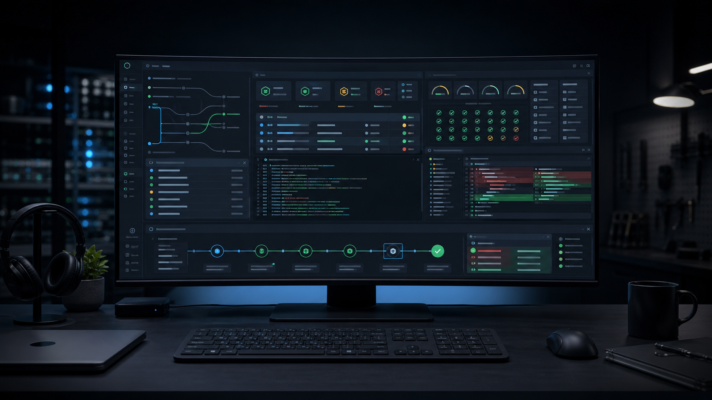

# MAWO - Agent Orchestration System



MAWO is a local-first safety and acceptance console for AI coding agents working
on real git repositories.

Repository: [https://github.com/guangzibodong/agent-orchestration-system](https://github.com/guangzibodong/agent-orchestration-system)

The first launch focus is deliberately narrow: turn coding-agent output into an
isolated, quality-gated, retryable, auditable, human-applied merge candidate
patch. MAWO does not auto-merge the main branch, does not create PRs by default,
and does not pretend failed gates are safe to ship.

## What MAWO Is For

AI coding tools such as Codex, Claude Code, Cursor, and shell-based agents can
make useful changes, but teams still need a trustworthy delivery loop:

- run work against a real repository without polluting the main workspace;
- capture stdout, stderr, git status, diffs, reports, and audit events;
- enforce required quality gates before a merge-ready conclusion exists;
- retry failed or cancelled runs without stale evidence confusion;
- give reviewers a readable report, merge candidate patch, and manual
  `git apply` command.

MAWO is the control surface for that loop. The product object is a requirement
delivery ticket; the execution layer remains workflow runs, jobs, worktrees,
quality gates, reports, artifacts, and merge candidates.

## Current Launch Status

The current P0 launch slice is ready for a controlled server deployment:

- real repository success path;
- required gate failure path;
- retry to success path;
- merge candidate generation;
- viewer/operator boundary;
- backup/restore smoke;
- desktop and mobile UI smoke.

Latest recorded full launch gate evidence is written under
`output/launch-readiness/` when `npm run launch:gate:postgres` or
`npm run launch:gate:local` is run. The deployment runbook is
[docs/SERVER_DEPLOYMENT.md](docs/SERVER_DEPLOYMENT.md).

## Product Surface

The primary UI is the Requirement Delivery Console:

- New Requirement flow;
- Repository Safety Card;
- Requirement Queue;
- Stage Stepper;
- Decision Queue;
- Gate Result and Review Evidence panels;
- Artifact Drawer;
- Viewer Mode banner;
- Legacy Run Console demoted to secondary ops/debug support.

The frozen P0 scope is documented in
[docs/product/REQUIREMENTS_FREEZE.md](docs/product/REQUIREMENTS_FREEZE.md).
Non-goals for this launch include automatic task decomposition, a full DAG
editor, multi-agent competition, automatic PR creation, cloud multi-tenancy,
enterprise SSO/RBAC, cost management, and long-term memory.

## Architecture


| Layer          | Location                 | Responsibility                                                    |
| -------------- | ------------------------ | ----------------------------------------------------------------- |
| Web Console    | `apps/web`               | Requirement Delivery Console, viewer/operator UI, review evidence |
| API Server     | `apps/api/src/server.ts` | Fastify API, auth boundary, requirement/workflow orchestration    |
| Runner         | `apps/api/src/runner`    | shell/CLI agent execution, worktree isolation, gates, reports     |
| Shared Schemas | `packages/shared`        | Zod schemas and TypeScript contracts shared by web/API            |
| File State     | `.mawo/state`            | local workflow, job, repository, and audit persistence            |
| Artifacts      | `.mawo/artifacts`        | stdout, stderr, patches, reports, merge candidates                |
| Postgres Mode  | `apps/api/prisma`        | optional state and queue backend for worker topology              |


## Quick Start

On Windows, the repository includes portable Node.js and Git under `.tools`:

```powershell
$root = (Get-Location).Path
$env:PATH = "$root\.tools\node;$root\.tools\git\cmd;$env:PATH"
npm.cmd install
npm.cmd run dev
```

Default local URLs:

- Web: `http://127.0.0.1:3000`
- API: `http://127.0.0.1:4000`
- Health: `http://127.0.0.1:4000/health`
- Readiness: `http://127.0.0.1:4000/readiness`

Core verification commands:

```powershell
npm.cmd run env
npm.cmd run typecheck
npm.cmd run lint
npm.cmd run test
npm.cmd run build
npm.cmd run smoke:ui
npm.cmd run smoke:api
npm.cmd run smoke:api:requirements
npm.cmd run smoke:backup:restore
npm.cmd run smoke:readiness:production
```

For a Postgres-backed launch target, also run:

```powershell
npm.cmd run db:validate
npm.cmd run db:migrate:deploy
npm.cmd run smoke:api:postgres
npm.cmd run launch:gate:postgres
```

The checked-in database migration baseline lives in
`apps/api/prisma/migrations`. For local development, use
`npm run db:migrate`; for shared, staging, or production databases, use
`npm run db:migrate:deploy`.

## Server Deployment

Fastest single-server deployment path:

```bash
git clone https://github.com/guangzibodong/agent-orchestration-system.git mawo
cd mawo
cp .env.example .env
# Fill MAWO_API_TOKEN, MAWO_ALLOWED_REPOSITORY_ROOTS, POSTGRES_PASSWORD,
# NEXT_PUBLIC_API_URL, and optional MAWO_VIEWER_API_TOKEN.
docker compose config
docker compose up --build -d
docker compose ps
```

Minimum production environment values:

```text
NODE_ENV=production
API_HOST=0.0.0.0
API_PORT=4000
MAWO_API_TOKEN=<long-random-operator-token>
MAWO_VIEWER_API_TOKEN=<optional-read-only-token>
MAWO_ALLOWED_REPOSITORY_ROOTS=<absolute-root-for-repos>
NEXT_PUBLIC_API_URL=https://<your-api-host-or-reverse-proxy>
MAWO_STATE_BACKEND=file
MAWO_QUEUE_BACKEND=in_process
MAWO_API_REPLICA_COUNT=1
POSTGRES_PASSWORD=<strong-postgres-password>
```

Put the API behind TLS, VPN, IP allowlist, or reverse proxy auth. The API can
execute repository commands, so anyone with the operator token should be treated
as a trusted operator.

Full server checklist: [docs/SERVER_DEPLOYMENT.md](docs/SERVER_DEPLOYMENT.md).
Operations runbook: [docs/OPERATIONS.md](docs/OPERATIONS.md).

## API Snapshot

Important endpoints:

```text
GET  /health
GET  /readiness
GET  /agents
GET  /agents/health
GET  /operations/snapshot
GET  /requirements
POST /requirements
GET  /requirements/:id
PATCH /requirements/:id
POST /requirements/:id/confirm-plan
POST /requirements/:id/enqueue
POST /requirements/:id/retry
GET  /requirements/:id/report
GET  /requirements/:id/merge-candidate
GET  /workflows
POST /workflows/repository
POST /workflows/:id/enqueue
POST /workflows/:id/retry
POST /workflows/:id/review
GET  /workflows/:id/report
GET  /workflows/:id/merge-candidate
GET  /jobs
POST /jobs/:id/cancel
GET  /audit-events
GET  /launch/evidence/latest
```

## Real CLI Agent Setup

Shell execution is available when a task explicitly uses `shell`. Real CLI
agents are configured by environment variables:

```powershell
$env:MAWO_CODEX_COMMAND_TEMPLATE = "codex run --prompt-file {promptFile}"
$env:MAWO_CODEX_AUTH_PROBE_COMMAND = "codex auth status"
$env:MAWO_CLAUDE_COMMAND_TEMPLATE = "claude -p @{promptFile}"
$env:MAWO_CLAUDE_AUTH_PROBE_COMMAND = "claude --version"
$env:MAWO_CURSOR_COMMAND_TEMPLATE = "cursor-agent {promptFile}"
$env:MAWO_CURSOR_AUTH_PROBE_COMMAND = "cursor-agent --version"
```

Supported placeholders:

- `{promptFile}`: MAWO-generated prompt file outside the task worktree;
- `{workspace}`: isolated task worktree path;
- `{goal}`: requirement/workflow goal.

Use `GET /agents/health` to verify configured agent commands without exposing
the full command templates.

## Data, Backup, And Restore

Default file-backed runtime data lives under `.mawo`:

```text
.mawo/
  state/
    workflows.json
    jobs.json
    repositories.json
    audit-events.json
  artifacts/
    <workflowId>/
      report.json
      merge-candidate.patch
      merge-candidate.json
      tasks/<taskId>/stdout.txt
      tasks/<taskId>/stderr.txt
      tasks/<taskId>/patch.diff
```

Before deployment, rollback, or manual cleanup, back up `.mawo` or the
`mawo_state` Docker volume. The file-backed restore path is covered by:

```powershell
npm.cmd run smoke:backup:restore
```

## Known Limits For First Launch

- Local-first operator/viewer token model; no user accounts, SSO/RBAC, or
  tenant isolation.
- File state plus in-process queue supports one API replica.
- Postgres state plus Postgres queue requires `worker:postgres` processes.
- Redis is included in Compose but queue support is reserved.
- Public production exposure still requires TLS and an external auth/network
  boundary.
- Target repositories must be git repositories with a committed `HEAD`.
- MAWO generates merge candidates and explicit manual apply commands; it does
  not auto-merge main by default.

## Documentation

- [Server Deployment](docs/SERVER_DEPLOYMENT.md)
- [Operations Runbook](docs/OPERATIONS.md)
- [Launch Readiness Evidence](docs/LAUNCH_READINESS_EVIDENCE.md)
- [PRD](docs/product/PRD.md)
- [Requirements Freeze](docs/product/REQUIREMENTS_FREEZE.md)
- [Role Workflow](docs/product/ROLE_WORKFLOW.md)
- [User Journeys](docs/product/USER_JOURNEYS.md)
- [UI Information Architecture](docs/product/UI_INFORMATION_ARCHITECTURE.md)
- [UI Stage Brief](docs/product/UI_STAGE_BRIEF.md)
