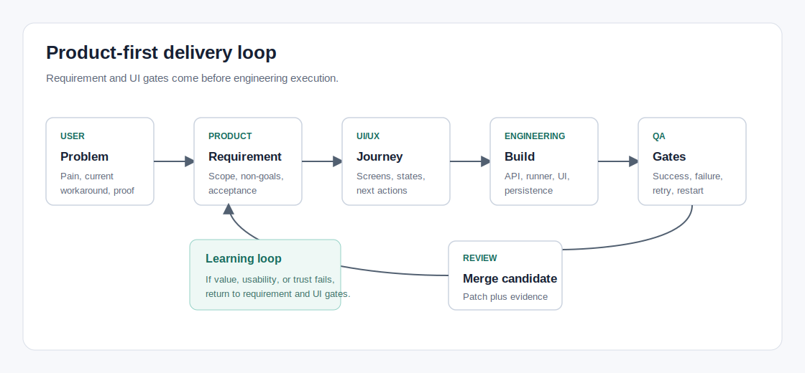

# UI Information Architecture

Date: 2026-06-06
Status: design direction before next UI implementation

## 1. Design Direction

The console should feel like a delivery operations tool, not a demo runner.

Primary object:

> Requirement Delivery Ticket

Secondary objects:

- repository;
- task;
- workflow execution;
- quality gate;
- report;
- merge candidate;
- audit event;
- agent health.

The first screen should answer:

1. What requirement needs my attention?
2. Is the selected repository safe?
3. What stage is each delivery in?
4. What can I confidently review, retry, or apply?

## 2. Navigation

Recommended navigation:

- Console
- Requirements
- Execution
- Review
- Value Reports
- Repositories
- Agents
- Quality Gates
- Audit & Operations

Operations, readiness, worker status, and token settings should exist, but they should not dominate the first user journey.

## 3. First Screen Layout

Top bar:

- workspace/repository selector;
- search;
- primary button: `New Requirement`;
- compact health indicators: API, worker, queue;
- settings menu for operator/viewer token and advanced runtime options.

KPI row:

- active requirements;
- needs clarification;
- running tasks;
- failed gates;
- waiting for review;
- delivered last 7 days.

Main area:

- left: requirement queue table or kanban;
- center: selected requirement delivery flow;
- right: decision queue.

Lower area:

- collapsed operational summary;
- recent failed jobs;
- audit highlights.

## 4. First Screen Wireframe



```text
┌────────────────────────────────────────────────────────────────────────────┐
│ Repo selector          Search              New Requirement     Health      │
├────────────────────────────────────────────────────────────────────────────┤
│ Active │ Clarify │ Running │ Gate failed │ Review │ Delivered 7d          │
├──────────────────────────────┬───────────────────────────┬────────────────┤
│ Requirement queue            │ Delivery flow             │ Decisions       │
│ - title                      │ Requirement               │ - confirm plan  │
│ - repo                       │ -> Plan                   │ - retry gate    │
│ - stage                      │ -> Execute                │ - review patch  │
│ - next action                │ -> Gates                  │ - clean worktree│
│ - risk                       │ -> Review                 │                │
│ - updated                    │ -> Value report           │                │
├──────────────────────────────┴───────────────────────────┴────────────────┤
│ Operational details: worker capacity, failed jobs, audit, readiness        │
└────────────────────────────────────────────────────────────────────────────┘
```

## 5. Requirement Detail Page

Tabs:

- Overview
- Requirement
- Plan
- Execution
- Gates
- Review
- Value Report
- Audit

Overview must show:

- current stage;
- repository safety contract;
- next action;
- risk level;
- last execution result;
- gate summary;
- merge candidate status.

Requirement tab fields:

- title;
- repository;
- business goal;
- context paths;
- constraints;
- non-goals;
- acceptance criteria;
- quality gates;
- timeout/budget;
- risk notes.

Plan tab:

- task list or small DAG preview;
- task objective;
- dependency;
- agent/command;
- gate mapping;
- task-level acceptance;
- owner.

Execution tab:

- current job;
- queued/running/cancelled state;
- task progress;
- log drawer;
- artifact links;
- retry/cancel/reassign actions.

Review tab:

- delivery summary;
- changed files;
- patch artifacts;
- gate results;
- risks;
- merge candidate;
- approve/reject/rework actions.

Value Report tab:

- goal achieved or not;
- what changed;
- time spent;
- gates run;
- residual risks;
- before/after manual workflow reduction.

## 6. Components

| Component | Purpose |
| --- | --- |
| Repository safety card | Branch, clean/dirty, allowed root, HEAD, no-auto-merge contract |
| Requirement stage stepper | Draft -> clarification -> plan -> run -> review -> delivered |
| Decision queue | Shows only items that need user action |
| Gate result panel | Required/optional gates, command, exit code, artifacts |
| Merge candidate panel | Patch path, changed files, `git apply`, risk warning |
| Artifact drawer | stdout, stderr, patch, report, audit links |
| Agent availability panel | Shell and CLI agent configured/unconfigured states |
| Worktree cleanup control | Retain, inspect, or cleanup isolated workspaces |

## 7. Current UI To Demote

These surfaces should remain available but move out of the primary path:

- `Shell Run`, `Worktree Run`, and `Agent Run` demo buttons.
- Operator/viewer token controls.
- Operations summary as a large first-screen block.
- Raw repository workflow command form as the default first action.
- Long stdout/stderr/patch blocks in the primary layout.
- Workflow IDs, job IDs, and artifact paths as headline content.
- Full operations and readiness details.

## 8. UI Acceptance Criteria

The redesigned first screen is acceptable only if:

- The primary CTA is `New Requirement`.
- A new user can identify the safe real-repo path without reading docs.
- Demo actions are visually secondary.
- Dirty repo, missing agent config, failed gate, and retry states have clear next actions.
- Text does not overflow on desktop or mobile.
- Logs and patches are discoverable but not forced into the first screen.
- Operator-only actions are disabled or hidden in viewer mode.
